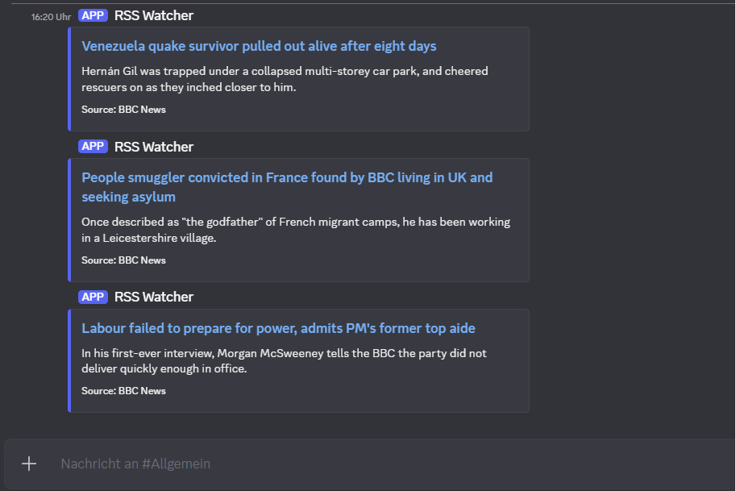

# RSS Watcher

A small Python script that watches an RSS feed and reports new entries to a Discord channel.
Handy for keeping up with a blog, a news source or a release feed without checking it yourself all
the time.



## How it works

On each run the script loads the feed, compares the entries against a list of ones it has already
reported (`seen.json`) and sends everything new as a formatted message to a Discord webhook.
Afterwards it updates the list so nothing gets reported twice.

On the very first run only the newest few entries are reported, so a full feed doesn't fire off
dozens of messages at once.

## Installation

Requires Python 3.10 or newer.

```powershell
cd D:\Projects\rss-watcher
python -m venv venv
.\venv\Scripts\Activate.ps1
pip install -r requirements.txt
```

On macOS or Linux use `source venv/bin/activate` instead.

## Configuration

All settings come from a `.env` file so the webhook URL isn't in the code:

```powershell
copy .env.example .env
```

Values in the `.env`:

| Variable | Required | Meaning |
| --- | --- | --- |
| `FEED_URL` | yes | The RSS feed to watch |
| `DISCORD_WEBHOOK_URL` | yes | The webhook URL of the target channel |
| `POLL_INTERVAL` | no | Time between two checks in loop mode, in seconds (default 900, i.e. 15 minutes) |
| `MAX_FIRST_RUN` | no | How many entries to report at most on the first run (default 3) |

You create a webhook URL in Discord under Server Settings -> Integrations -> Webhooks.

## Usage

A single run, for example for a scheduled task:

```powershell
python watcher.py
```

Continuous mode, checking every `POLL_INTERVAL` seconds:

```powershell
python watcher.py --loop
```

## Every 15 minutes with Task Scheduler (Windows)

For a regular check without keeping the script running all the time, the Windows Task Scheduler
works well:

1. Open Task Scheduler, "Create Basic Task".
2. Set the trigger to daily, then in its properties set "Repeat task every 15 minutes".
3. As the action choose "Start a program":
   - Program: `D:\Projects\rss-watcher\venv\Scripts\python.exe`
   - Argument: `watcher.py`
   - Start in: `D:\Projects\rss-watcher`

## Layout

```
rss-watcher/
  watcher.py        the script
  requirements.txt
  .env.example
  .gitignore
  README.md
  seen.json         created at runtime
```

## Notes

Only public RSS feeds are queried. The webhook URL lives only in the `.env` and is excluded from the
repository via `.gitignore`. In `seen.json` the script remembers the most recently reported entries
(the last 500) so nothing is sent twice and the file doesn't grow forever.
